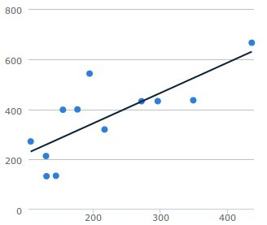
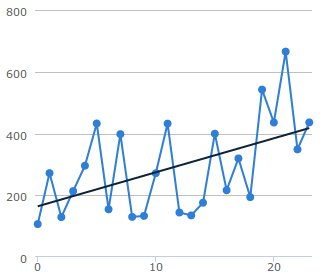
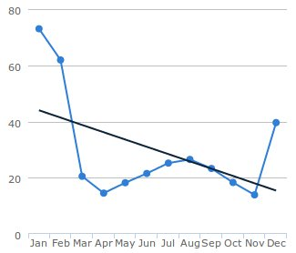

# Highcharts Trendline Example

This project illustrates how you can easily add a trendline to your [Highchart](http://www.highcharts.com) charts.

## Usage

Include the `regression.js` script into your HTML page.

Given your source data array, supply a function which calls `fitData(<source>).data` to produce the regression data for the trendline.

E.g.

```javascript
// E.g. source data
var sourceData = [
    [106.4, 271.8], [129.2, 213.4],
    [295.6, 432.3], [154.4, 398.1],
    [129.9, 133.2], [271.5, 432.1],
    [144.0, 134.7], [176.0, 399.2],
    [216.4, 319.2], [194.1, 542.1],
    [435.6, 665.3], [348.5, 435.9]
];

var chart_linear = new Highcharts.Chart({
    chart: {
      renderTo: 'linear'
    },
    plotOptions: {
      series: {
        enableMouseTracking: false
      }
    },
    series: [{
      type: 'scatter',
      data: sourceData
    },
    {
      type: 'line',
      marker: { enabled: false },
      /* function returns data for trend-line */
      data: (function() {
        return fitData(sourceData).data;
      })()
    }]
});
```

## Examples

Checkout the demo HTML files for examples of how to plot various trendlines.

* 
* 
* 

# Credits

The code for the `regression.js` script was extracted from [jqplot.trendline.js](http://www.jqplot.com/docs/files/plugins/jqplot-trendline-js.html), by Chris Leonello.
